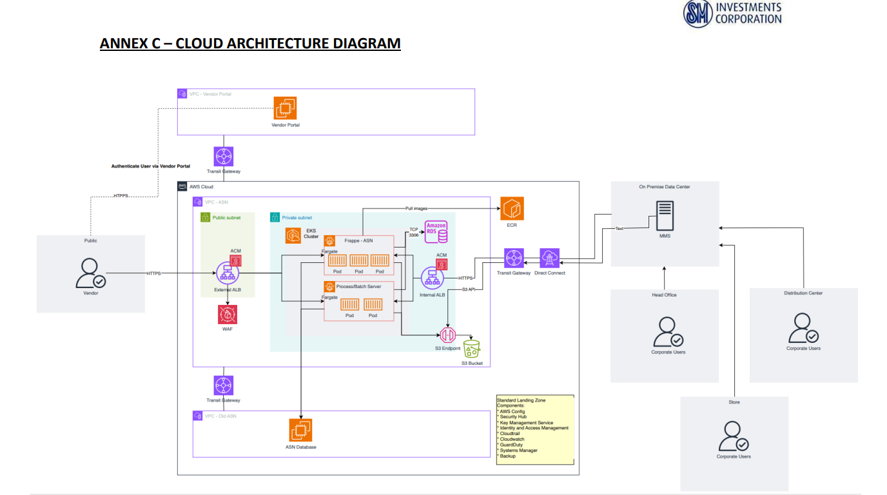

# smri-asn-v2
#### SMRI ASN Tech Refresh

### EKS Fargate Environment

This environment is set up using Amazon EKS with Fargate to manage containerized applications. The following AWS resources are included:

- **ACM**: For managing SSL/TLS certificates.
- **ALB**: Application Load Balancer for distributing incoming traffic.
- **CloudWatch**: For monitoring and logging.
- **EKS**: Elastic Kubernetes Service for orchestrating containers.
- **KMS**: Key Management Service for encryption.
- **RDS**: Relational Database Service for database management.
- **S3 Bucket**: For object storage.
- **Security Group**: For controlling inbound and outbound traffic.
- **Network Module**: Provides VPC details.

---
| Resources       | Done | Remarks | Note                          |
|-----------------|------|---------|-------------------------------|
| ACM             | x    |         |                               |
| ALB             | x    |         |                               |
| CloudWatch      | x    |         |                               |
| EKS             | x    |         |                               |
| KMS             | x    |         |                               |
| RDS             | x    |         |                               |
| S3 Bucket       | x    |         |                               |
| Security Group  | x    |         |                               |
| Network Module  |      |         | Provides VPC details          |
#### Infrastructure Diagram
